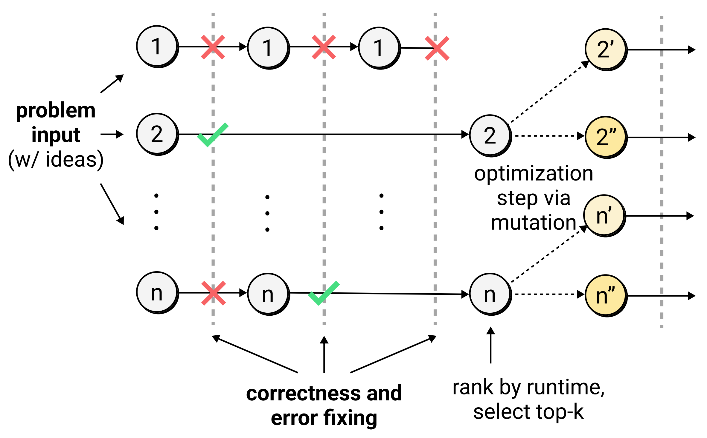
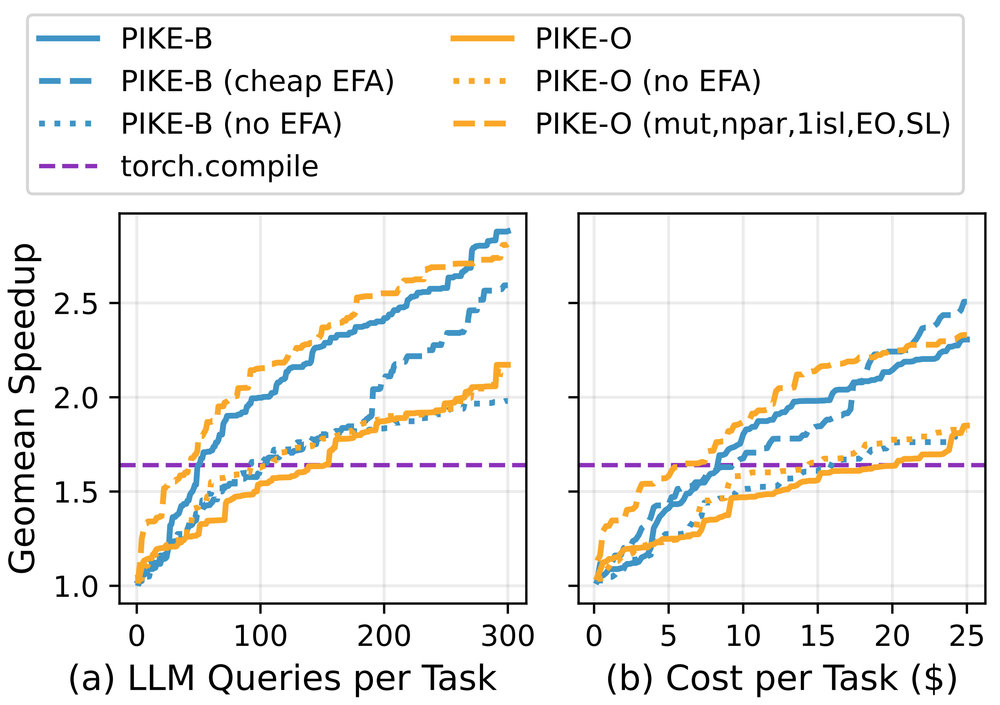
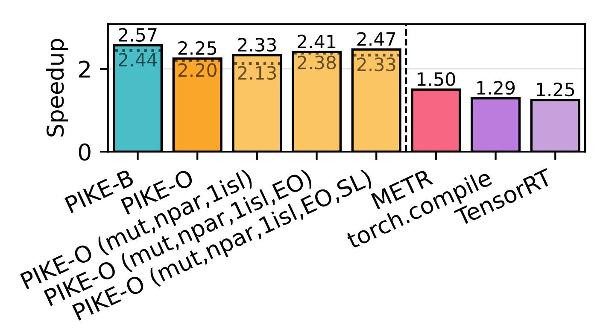
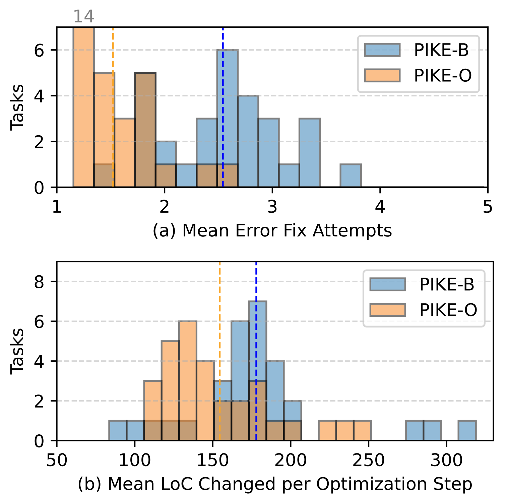
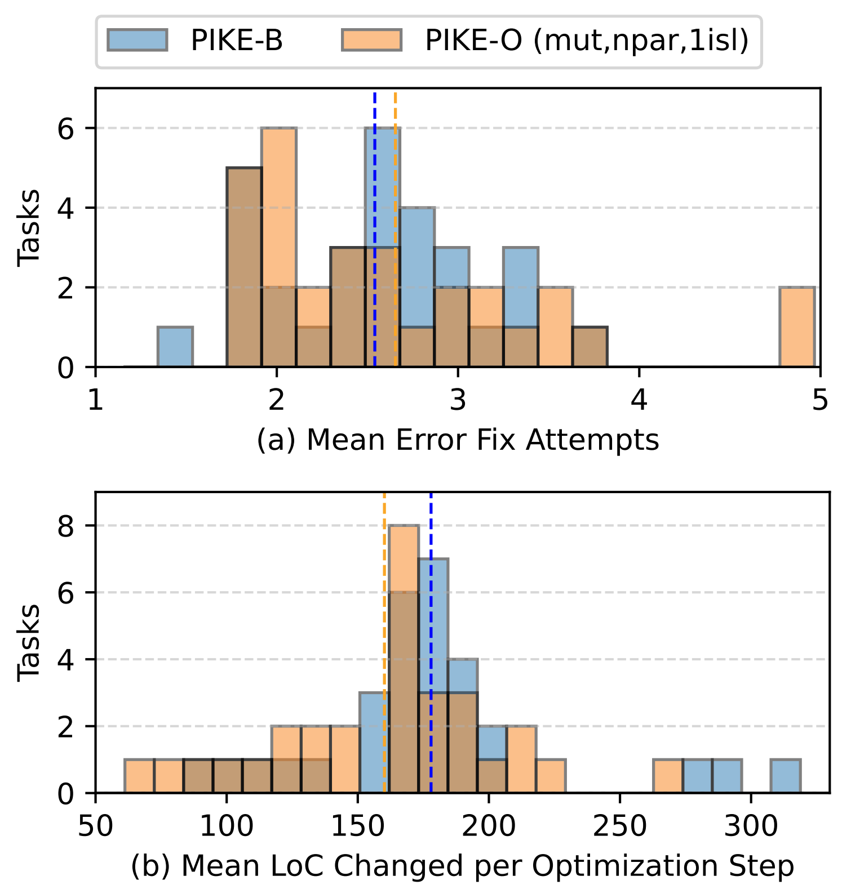

This post gives an overview of our recent paper preprint, *[Optimizing PyTorch Inference with LLM-Based Multi-Agent Systems](https://arxiv.org/abs/2511.16964)*, which I authored along with [Luka Grbcic](https://lukagrbcic.github.io/), [Samuel Williams](https://profiles.lbl.gov/20370-samuel-williams), and [Costin Iancu](https://www.linkedin.com/in/costin-iancu-5a8b011/).

We introduce a logical framework for comparing multi-agent PyTorch optimization systems, along with our implementations within it, which we collectively call *PyTorch Inference Kernel Evolution* (PIKE). The [PIKE code](https://github.com/pike-project/pike) has been made open-source on GitHub. We explore the configuration space with the help of [OpenEvolve](https://github.com/algorithmicsuperintelligence/openevolve), and we manage to outperform PyTorch's eager execution mode by up to 2.88×!

## GPU Optimization Problem

New generations of AI datacenter GPUs are now being rolled out on an annual basis, forcing software support to play a constant game of catch-up. To make the problem worse, new AI/ML model techniques are being proposed constantly. This leads to a set of workloads that library/compiler engineers are unlikely to optimize for, unless an idea gains a lot of traction from the community.

<!-- GPU performance optimization using CUDA or Triton is a notoriously challenging process. This is why software lags behind the latest generation of NVIDIA GPUs, and ML library/compiler engineers are forced to optimize only for the most critical workloads. -->

Without excellent library/compiler support, demonstrating good performance for a new idea could mean tons of manual GPU programming. Thus, it's getting harder for AI/ML researchers to challenge conventional wisdom.

To name one example, in December 2022, [H3](https://arxiv.org/abs/2212.14052) showed the viability of replacing the standard Transformer architecture in language modeling with a hybrid architecture that integrates state space model (SSM) layers. However, achieving competitive performance in their paper required the authors to develop complex, novel GPU kernels.
Adoption of the idea into modern LLM inference engines took **3 years**, mainly because of GPU memory management challenges [[vLLM announcement](https://pytorch.org/blog/hybrid-models-as-first-class-citizens-in-vllm/), [SGLang announcement](https://pytorch.org/blog/hybrid-models-meet-sglang-more-than-full-attention/)].

<!-- The idea is **only now** being adopted into modern LLM inference engines, and doing so took **3 years** mainly due to GPU memory management adjustments [[vLLM announcement](https://pytorch.org/blog/hybrid-models-as-first-class-citizens-in-vllm/), [SGLang announcement](https://pytorch.org/blog/hybrid-models-meet-sglang-more-than-full-attention/)]. -->

<!-- Furthermore, adoption on mainstream LLM inference engines took 3 years, -->

Can we find a way to eliminate manual GPU performance engineering from the equation using LLMs, and what would such a system look like?

## Our Solution

Our target GPU was an NVIDIA H100. We used a modified version of [KernelBench](https://arxiv.org/abs/2502.10517), a benchmark suite covering a range of machine learning architectures in PyTorch. We target these key levels from the suite:

- **Level 3 (Curated blocks from older models):** RNNs, Attention, Convolutions
- **Level 5 (Frontier workloads from SOTA 2024 models):** DeepSeek-V3, Llama 3, Mamba-2, Hunyuan Video

Many prior works have shown effective LLM-based optimization systems that target KernelBench tasks, but the dynamics of multi-agent systems for this performance engineering problem remain unexplored. We developed a logical framework to analyze these systems and fill the gap!

<!-- As new generations of GPUs roll out, and new AI model techniques are proposed, we are met with a constant dilemma: how do we keep up with  -->

<!-- Thus, GPU performance optimization has become a crucial aspect of modern AI inference.  -->


Here's a simplified visual of the problem and our setup. We built a robust, performant evaluator that gets PyTorch/CUDA/Triton code, checks for correctness, runs performance tests, then returns back errors and metrics. The idea is that we can plug in an LLM-based system that iteratively improves the performance of the original PyTorch code by querying the evaluator in a loop, then eventually returns the fastest valid solution.

Using this setup, we developed a logical framework where evolutionary, LLM-based multi-agent systems can operate. Then, we identified some key hyperparameters of these evolutionary strategies that impact the optimization process, such as the explore/exploit ratio, islands, mutation/crossover, and LLM-based error fixing.

### PIKE-B (Branching Search)

We initially developed PIKE-B, a hand-written, exploit-heavy, evolutionary strategy that operates in optimization rounds.



PIKE-B spends a limited number of LLM queries on fixing errors using an error fixing agent (EFA). After a cutoff point, the best solutions from this round are ranked by runtime, then the top-k solutions are used as seeds for the next set of LLM queries. 

We call the strategy "exploit-heavy" because it concentrates effort on the best existing solutions. As it turns out, we find this approach to work surprisingly well in our results. Prior works have proposed similar approaches, but we are especially interested in **why** it works so well.

### PIKE-O (OpenEvolve)

To explore the hyperparameter space and understand what makes PIKE-B an effective strategy, we used [OpenEvolve](https://github.com/algorithmicsuperintelligence/openevolve), an open-source framework for LLM-based code evolution inspired by [AlphaEvolve](https://arxiv.org/abs/2506.13131). OpenEvolve made it simple to tune hyperparameters of the optimization process, and it fits cleanly into our logical framework.

**Importantly, OpenEvolve contains:**

- island-based evolution
- explore/exploit ratio settings
- solution library configuration settings

We modified OpenEvolve to incorporate LLM-based error fixing. We then applied a bunch of OpenEvolve configurations to KernelBench to better understand agent framework behavior.

## Results

We measured the performance of PIKE solutions against the original models (with PyTorch eager). We measured cost in 2 ways: LLM query count per task, and cost in $ per task for LLM queries. 

### Speedup Trajectories

For each PIKE implementation, we used the best solution generated within the current budget per task. We did this up to a budget of 300 queries per task, or around $25/task. Gemini 2.5 Pro was used everywhere, except for the cheap error fixing agent (EFA), where we used Gemini 2.5 Flash. Keep in mind, EFA uses a portion of the LLM budget too.



Geomean speedups for our filtered Level 3 are shown above. The default PIKE-O approach is quite explore-heavy. We ran a series of ablations to make it functionally equivalent to PIKE-B, shown in PIKE-O (mut,npar,1isl,EO,SL).

Interestingly, approaches without EFA do poorly, relative to those with EFA. Cheap EFA is cost effective here, and exploit-heavy strategies offer the best performance gains.

### Overall Speedups and Ablations

We ran ablations to dig deeper into multi-agent behavior for the task at hand. Note: we don't evaluate all combinatorial versions, since end-to-end runs are expensive and time-consuming.


Speedups over PyTorch eager for our **modified Level 3** are shown above. The full bar shows a budget of 300 LLM queries per task, and the dashed lines show $25/task.

The series of PIKE-O ablations shifts PIKE-O from being an explore-heavy strategy towards being an exploit-heavy strategy, with PIKE-O (mut,npar,1isl,EO,SL) being virtually equivalent to PIKE-B without IBA (initial brainstorming agent). As we should expect, this PIKE-O variant displays very similar performance to PIKE-B and PIKE-B (no IBA).

The *"1isl"* parameter changes PIKE-O from having 3 islands to just 1 island, and a notable change in performance shows up at that ablation step. Reducing the evolutionary exploration to one island makes this an exploit-focused process, and we can see this leads to a big performance boost. Clearly, worrying about early convergence is not worth it in our budget range!

<!--  -->

<div class="flex justify-center">
  
</div>

Speedups over PyTorch eager for **Level 5** are shown above for a limited set of our implementations. The full bar shows a budget of 300 LLM queries per task, and the dashed lines show $50/task.

Similar to our Level 3 results, PIKE implementations perform much better than PyTorch eager and other competitors, including ~2× over `torch.compile`! The difference in PIKE-O variants is more subtle on these challenging tasks.

<!-- 

 -->

<!-- ## Understanding the LLM-Generated Code

<div class="flex justify-center">
  
</div>

<div class="flex justify-center">
  
</div> -->

## Key Takeaways

Based on results shown here and in the paper:

- it is worth it to spend some of your budget on error fixing agents
- using a cheap error fixing LLM can be cost effective, alongside a more powerful model for actual code optimization
- exploit-heavy strategies (e.g. reducing island count to 1) are favorable under the budget we explored
- performance correlates with the granularity of optimization steps (see [the paper](https://arxiv.org/abs/2511.16964) for more details)

We've demonstrated that LLM-based multi-agent systems show great promise in mitigating the GPU optimization dilemma. More importantly, we've learned a bit about how to characterize multi-agent systems, and why certain configurations perform better than others! If you found our work useful, consider citing the paper:

```bibtex
@misc{nagaitsev2025pike,
    title={Optimizing PyTorch Inference with LLM-Based Multi-Agent Systems}, 
    author={Kirill Nagaitsev and Luka Grbcic and Samuel Williams and Costin Iancu},
    year={2025},
    eprint={2511.16964},
    archivePrefix={arXiv},
    primaryClass={cs.MA},
    url={https://arxiv.org/abs/2511.16964}, 
}
```

---

*Note: a similar version of this article has been cross-posted on the [OpenEvolve blog](https://algorithmicsuperintelligence.ai/blog/index.html)*
